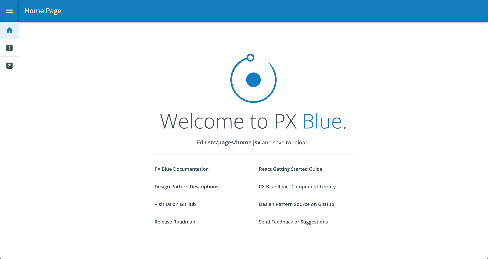
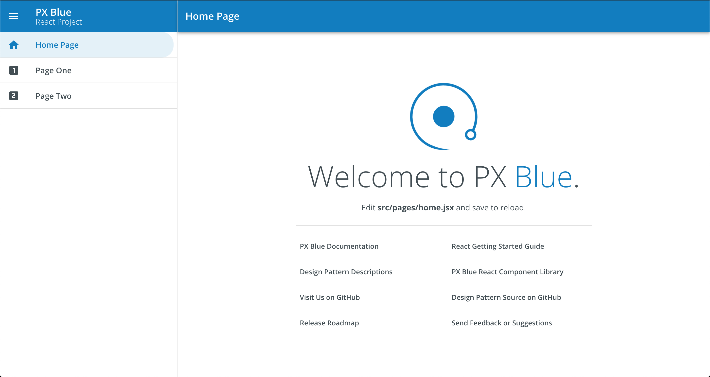
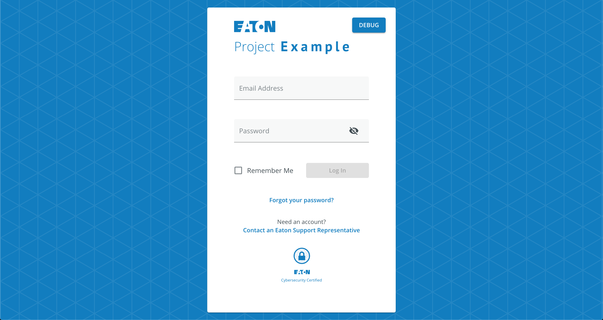

# React CLI Templates

These are project templates that are used by Create React App when starting a new Brightlayer UI project. They are used behind the scenes by the Brightlayer UI CLI.

## Available Templates

### Blank

The [Blank template](https://www.npmjs.com/package/@brightlayer-ui/cra-template-blank-typescript) provides a bare-bones application with Brightlayer UI components and themes automatically configured and ready to use.

### Routing

The [Routing template](https://www.npmjs.com/package/@brightlayer-ui/cra-template-routing-typescript) provides all of the essential Brightlayer UI configuration as well as additional configuration for using using [React Router](https://reactrouter.com/). It also adds a navigation Drawer to switch between several sample screens.

### Authentication

The [Authentication template](https://www.npmjs.com/package/@brightlayer-ui/cra-template-authentication-typescript) includes everything from the Routing template and also installs and configures the Brightlayer UI [react-auth-workflow](https://www.npmjs.com/package/@brightlayer-ui/react-auth-workflow) package to automatically wrap the main application with functions and screens for Login, Registration, Change Password, etc.

### Seed UI

The Seed UI template contains authorization feature like Self Invite, Admin Invite, Registration screens along with basic routing etc.

|                | placeholder landing page | navigation drawer & routing | login & registration screens |
| -------------- | ------------------------ | --------------------------- | ---------------------------- |
| Blank          | ✅                       |                             |                              |
| Routing        | ✅                       | ✅                          |                              |
| Authentication | ✅                       | ✅                          | ✅                           |
| Seed UI        | ✅                       | ✅                          | ✅                           |
## Screenshots

##### Routing Template With Collapsed Drawer



##### Routing Template With Expanded Drawer



##### Login Screen from Auth Template



## Usage

You can use these templates with the Brightlayer UI CLI (recommended):

```sh
npx -p @brightlayer-ui/cli blui new react --template=blank-typescript
npx -p @brightlayer-ui/cli blui new react --template=routing-typescript
npx -p @brightlayer-ui/cli blui new react --template=authentication-typescript
npx -p @brightlayer-ui/cli blui new react --template=seedui-typescript
```

or with the Create React App CLI:

```sh
npx create-react-app app-name --template @brightlayer-ui/blank-typescript
npx create-react-app app-name --template @brightlayer-ui/routing-typescript
npx create-react-app app-name --template @brightlayer-ui/authentication-typescript
npx create-react-app app-name --template @brightlayer-ui/seedui-typescript
```

## Testing Locally

If you would like to test these templates locally, you may do so by running the following command:

```
npx create-react-app myapp --template file:../path/to/template
```

For more information refer to the [CRA documentation](https://create-react-app.dev/docs/custom-templates/).

## Browser Support

Brightlayer UI CLI Templates will work with any modern browser. For details refer to our [Browser Support](https://brightlayer-ui.github.io/development/frameworks-web/react#browser-support) documentation.
